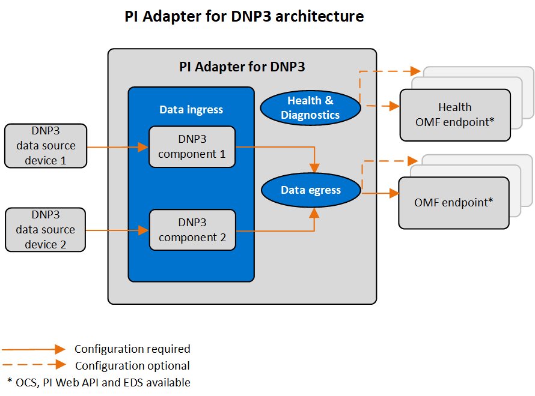

# PI Adapter for DNP3 overview

PI Adapter for DNP3 is a data-collection component that transfers time-series data from source devices to OMF (OSIsoft Message Format) endpoints in OSIsoft Cloud Services or PI Servers. DNP3 is a communication protocol commonly used in SCADA networks. The protocol is maintained by the DNP Users Group, and it is defined by IEEE Std 1815-2012. The adapter adheres to this standard and operates as a DNP3-L1 compliant master station, which may communicate with compliant outstations through TCP/IP.

You can install the adapter with a download kit from the OSIsoft Customer Portal. You can install the adapter on devices running either Windows or Linux operating systems.

Using the REST API, you can configure all functions of the adapter. The configurations are stored in JSON files. For data ingress, you must define an adapter component in the system components configuration for each device to which the adapter will connect. You configure each adapter component with the connection information for the device and the data to collect. For data egress, you must specify destinations for the data, including security for the outgoing connection. Additional configurations are available to egress health and diagnostics data, add buffering configuration to protect against data loss, and record logging information for troubleshooting purposes.

Once you have configured the adapter and it is sending data, you can use administration functions to manage the adapter or individual ingress components of the adapter. Health and diagnostics functions monitor the status of connected devices, adapter system functions, the number of active data streams, the rate of data ingress, the rate of errors, and the rate of data egress.

EdgeCmd utility is an OSIsoft proprietary command line tool that is used to configure and administer an adapter on both Linux and Windows operating systems. It is installed separately from the adapter.
