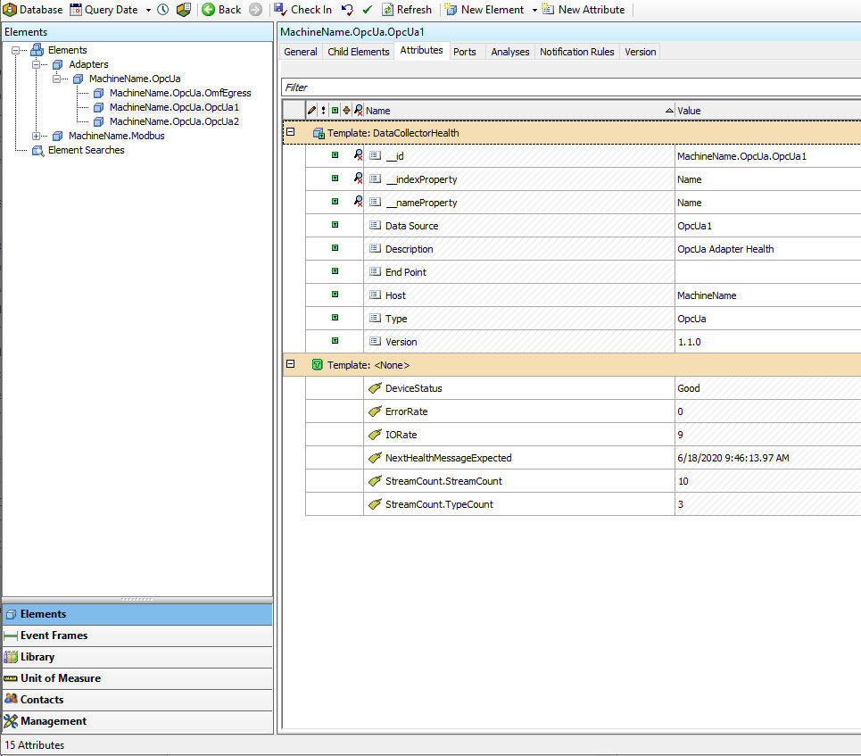

# Health and Diagnostics

AVEVA Adapters produce various types of health data. You can use health data to ensure that your adapters are running properly and that data flows to the configured OMF endpoints. For more information on available adapter health data, see [health](xref:AdapterHealth).

AVEVA Adapters also produce diagnostic data. You can use diagnostic data to find more information about a particular adapter instance. Diagnostic data lives alongside the health data and you can egress it using a health endpoint and setting `EnableDiagnostics` to`true`. You can configure `EnableDiagnostics` in the system's [General configuration](xref:GeneralConfiguration). For more information on available adapter diagnostics data, see [diagnostics](xref:AdapterDiagnostics).

<<<<<<< HEAD
In AVEVA Data Hub (ADH), both health and diagnostics data are created as assets. The data are available in the Asset Explorer and you can use them in the ADH Trend feature. For more information, see the ADH documentation [Assets](https://docs.osisoft.com/bundle/ocs/page/add-organize-data/organize-data/assets/asset-concept.html).
=======
In AVEVA Data Hub (ADH), both health and diagnostics data are created as assets. The data are available in the Asset Explorer and you can use them in the AVEVA Data Hub Trend feature. For more information, see the AVEVA Data Hub documentation [Assets](https://docs.osisoft.com/bundle/ocs/page/add-organize-data/organize-data/assets/asset-concept.html).
>>>>>>> ece23c8ba636e7eaadcc979848d692db04fa3832

## Health endpoint differences

Two OMF endpoints are currently supported for adapter health data:

- PI Web API
- AVEVA Data Hub (ADH)

There are a few differences in how these two systems treat the associated health and diagnostics data.

- PI Web API parses the information and sends it to configured PI servers for the OMF endpoint. The static data is used to create an AF structure on a PI AF server. The dynamic health data is time-series data that is stored in PI points on a PI Data Archive. You can see it in the AF structure as PI point data reference attributes.

<<<<<<< HEAD
- ADH does not currently provide a way to store the static metadata. For ADH-based adapter health endpoints, only the dynamic data is stored. Each value is its own stream with the timestamp property as the single index.
=======
- AVEVA Data Hub does not currently provide a way to store the static metadata. For AVEVA Data Hub-based adapter health endpoints, only the dynamic data is stored. Each value is its own stream with the timestamp property as the single index.
>>>>>>> ece23c8ba636e7eaadcc979848d692db04fa3832

## AF structure

With a health endpoint configured to a PI server, you can use PI System Explorer to view the health and diagnostics of an adapter. The element hierarchy is shown in the following image.

  

- The **Elements** root contains a link to an **Adapters** node. This is the root node for all adapter instances.
  
- Below **Adapters**, you will find one or more adapter nodes. Each node's title is defined by the node's corresponding computer name and service name in this format: `{ComputerName}.{ServiceName}`. For example, in the following image, **MachineName** is the computer name and **OpcUa** is the service name.
  
- To see the health and diagnostics values, click on an adapter node and select **Attributes**.

